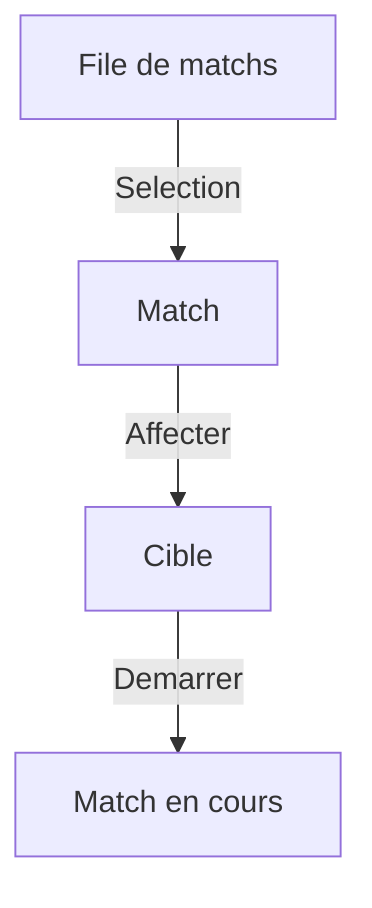
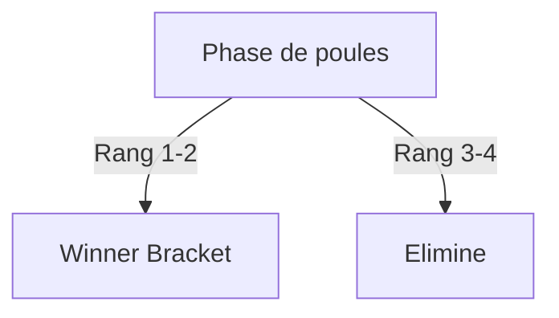
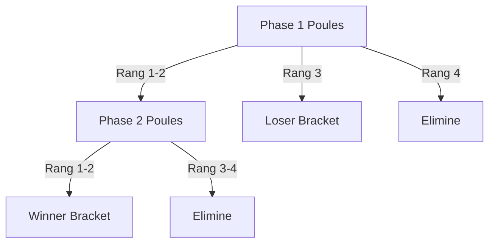

# Guide Admin (court, fonctionnel)

## Objectif
Piloter le tournoi du debut a la fin.

## Etapes d'un tournoi
1. Creation : nom, format, dates, nombre de cibles.
2. Inscriptions : joueurs enregistres et pointage.
3. Poules : generation des poules et verification des affectations.
4. Matchs de poule : lancement et suivi des scores.
5. Arbres : lancement des matchs a elimination.
6. Cloture : validation des derniers matchs et fin de tournoi.

## Avant
- Creer le tournoi et choisir le format.
- Configurer les poules et les cibles.
- Verifier que les joueurs sont bien inscrits et pointes.

## Options des poules
- Numero et nom de la phase (ordre des phases).
- Nombre de poules et joueurs par poule (capacite).
- Nombre de qualifies (progression par defaut).
- Option "perdants vers arbre" (progression par defaut).
- Destinations par classement : arbre, autre phase de poules, ou elimination.
- Statut : NOT_STARTED, EDITION, IN_PROGRESS, COMPLETED.
- En EDITION, utiliser "Edit players" pour ajuster les affectations.

### Exemple (poules vers arbre et elimination)
- 4 joueurs par poule.
- Destinations par rang :
	- 1er -> Winner Bracket
	- 2e -> Winner Bracket
	- 3e -> Loser Bracket
	- 4e -> Elimine

### Exemple (poules vers 2e phase de poules)
- Phase 1 : 4 poules de 4 joueurs.
- Destinations par rang :
	- 1er et 2e -> Phase 2 (poules)
	- 3e et 4e -> Elimine
- Phase 2 : 2 poules de 4 joueurs, puis routing vers arbre.

## Options des arbres
- Nom, type (simple elimination) et nombre de tours.
- Statut : NOT_STARTED, IN_PROGRESS, COMPLETED (modifiable avant le debut des matchs).
- Cibles dediees par arbre si besoin.
- Action admin "Populate from pools" pour peupler un arbre (role gagnant/perdant).

### Exemple (peuplement manuel depuis les poules)
- Ouvrir la vue Arbres.
- Cliquer "Populate from pools" sur Winner Bracket.
- Choisir la phase et le role "WINNER".
- Refaire pour Loser Bracket si besoin (role "LOSER").

Mermaid :
```mermaid
flowchart TD
	P[Resultats de poules] -->|Populate (WINNER/LOSER)| B[Entrees d'arbre]
	B -->|Creer| M[Matchs d'arbre]
```

## Vue des cibles (live)
- Lancer un match depuis la file avec une cible disponible.
- Annuler un match en cours pour liberer la cible et remettre le match en file.
- Corriger un score sur un match termine si besoin.

### Exemple (lancer un match)
- Aller sur la vue Cibles.
- Choisir un match dans la file.
- Selectionner une cible disponible et demarrer le match.

Mermaid :


## Configuration des poules
- Definir les destinations par classement : arbre, autre phase de poules, ou elimination.
- Quand les destinations sont definies, elles remplacent les regles d'avance/repêchage.
- Utiliser la vue des arbres pour peupler un arbre depuis les poules (role gagnant/perdant).

### Exemple (configuration simple)
- Une phase de poules : 2 poules de 4 joueurs.
- Destinations par rang :
	- 1er et 2e -> Winner Bracket
	- 3e et 4e -> Elimine
- Un Winner Bracket, 3 tours.
- Lancer les matchs depuis la vue Cibles.

Mermaid :


### Schema (flux simple)
Poules A/B
	-> Rang 1-2 -> Winner Bracket
	-> Rang 3-4 -> Elimine

### Exemple (8 joueurs)
Joueurs : Alex, Bea, Chen, Dani, Evan, Faye, Gio, Hana

Poule A : Alex, Bea, Chen, Dani
Poule B : Evan, Faye, Gio, Hana

Resultats :
- Classement poule A : Alex (1), Bea (2), Chen (3), Dani (4)
- Classement poule B : Evan (1), Faye (2), Gio (3), Hana (4)

Routing :
- Winner Bracket : Alex, Bea, Evan, Faye
- Elimines : Chen, Dani, Gio, Hana

### Exemple (multi-phase)
Phase 1 (4 poules de 4) :
- Rang 1-2 -> Phase 2 (poules)
- Rang 3 -> Loser Bracket
- Rang 4 -> Elimine

Phase 2 (2 poules de 4) :
- Rang 1-2 -> Winner Bracket
- Rang 3-4 -> Elimine

Notes :
- La phase 1 route uniquement via rankingDestinations.
- La phase 2 route vers le Winner Bracket, puis les arbres se jouent normalement.

Schema :
Phase 1 (poules)
	-> Rang 1-2 -> Phase 2 (poules)
	-> Rang 3   -> Loser Bracket
	-> Rang 4   -> Elimine
Phase 2 (poules)
	-> Rang 1-2 -> Winner Bracket
	-> Rang 3-4 -> Elimine

Mermaid :


### Exemple (routing total)
- Phase 1 :
	- 1er -> Winner Bracket
	- 2e -> Phase 2 (poules)
	- 3e -> Loser Bracket
	- 4e -> Elimine
- Phase 2 :
	- 1er et 2e -> Winner Bracket
	- 3e et 4e -> Elimine

## Pendant
- Lancer un match depuis une poule ou la vue cibles.
- Prioriser un autre match en annulant celui en cours (il retourne en file).
- Corriger un score si necessaire.

## Boutons speciaux
- Remise a zero (poule ou arbre) : reinitialise les matchs de la zone.
- Completer le tour : termine un tour d'arbre automatiquement.
- Annuler un match (vue cibles) : libere la cible et remet le match en file.
- Recalculer la progression : reconstruit les phases suivantes.

## Apres
- Completer les tours d'arbres restants.
- Verifier que le tournoi est termine.

## Liens utiles
- [Configuration admin](./ADMIN_SETUP.fr.md)
- [Commandes](./COMMANDS.fr.md)
- [API](./API.fr.md)
- [Tests](./TESTING.fr.md)
- [Deploiement](./DEPLOYMENT.fr.md)
- [Index documentation](./README.fr.md)
