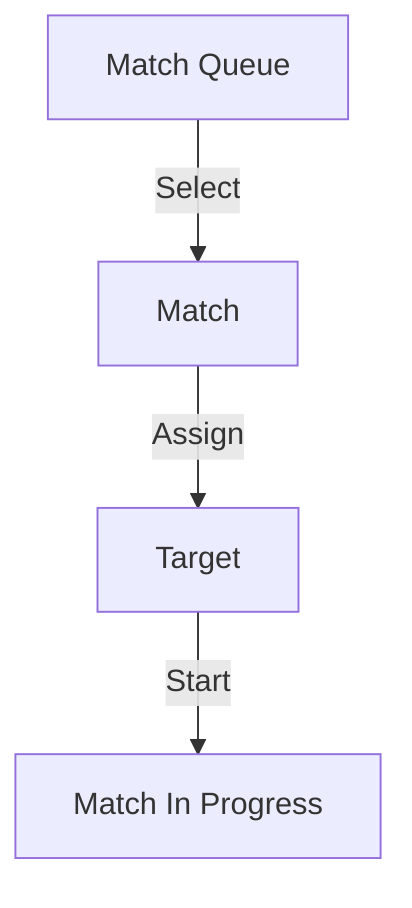
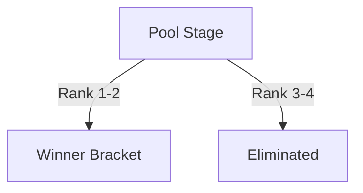
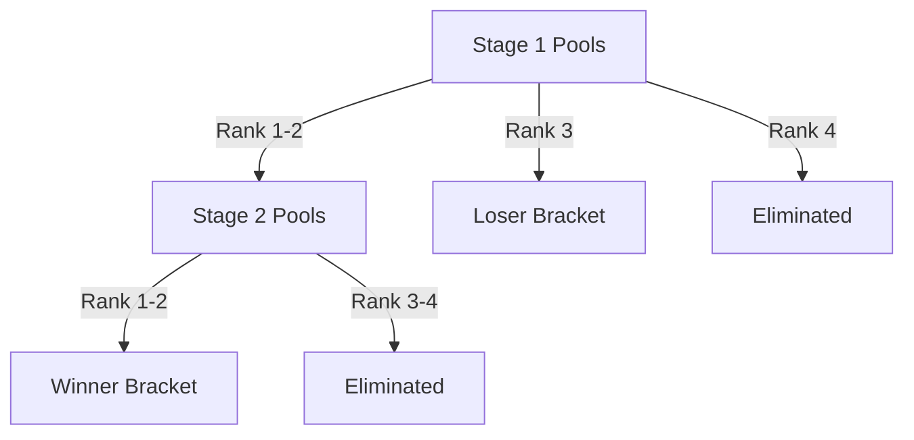

# Admin Guide (short, functional)

## Goal
Run a tournament from start to finish.

## Tournament steps
1. Creation: name, format, dates, target count.
2. Registration: players registered and checked in.
3. Pools: generate pools and verify assignments.
4. Pool matches: start matches and track scores.
5. Brackets: run elimination matches.
6. Closure: validate final matches and finish tournament.

## Before
- Create the tournament and choose the format.
- Configure pools and targets.
- Make sure players are registered.

## Pool options
- Stage number and name (ordering for multi-stage pools).
- Pool count and players per pool (capacity).
- Advance count (default progression when no custom routing).
- Losers to bracket toggle (default loser routing).
- Ranking destinations per position: bracket, another pool stage, or elimination.
- Stage status: NOT_STARTED, EDITION, IN_PROGRESS, COMPLETED.
- In EDITION, use "Edit players" to adjust assignments.

### Example (pools to brackets + elimination)
- 4 players per pool.
- Destinations by rank:
	- 1st -> Winner Bracket
	- 2nd -> Winner Bracket
	- 3rd -> Loser Bracket
	- 4th -> Eliminated

### Example (pools to another pool stage)
- Stage 1: 4 pools of 4 players.
- Destinations by rank:
	- 1st and 2nd -> Stage 2 (pools)
	- 3rd and 4th -> Eliminated
- Stage 2: 2 pools of 4 players, then route to bracket.

## Bracket options
- Name, type (single elimination), and total rounds.
- Status: NOT_STARTED, IN_PROGRESS, COMPLETED (can edit before matches start).
- Dedicated targets can be assigned per bracket.
- Admin action "Populate from pools" to seed entries (winner/loser role).

### Example (manual population from pools)
- Open Brackets view.
- Click "Populate from pools" on the Winner Bracket.
- Select the pool stage and role "WINNER".
- Repeat for Loser Bracket if needed (role "LOSER").

Mermaid:
```mermaid
flowchart TD
	P[Pool Stage Results] -->|Populate (WINNER/LOSER)| B[Bracket Entries]
	B -->|Create| M[Bracket Matches]
```

## Targets view (live)
- Start a match by selecting a queued match and a target.
- Cancel a running match to free the target and return it to the queue.
- Update scores for completed matches when needed.

### Example (start a match)
- Go to Targets view.
- Pick a match from the queue.
- Select an available target and start the match.

Mermaid:


## Pool configuration
- Define ranking destinations per position: bracket, another pool stage, or elimination.
- When destinations are set, they override advance/loser rules for that stage.
- Use the brackets view to populate a bracket from pool results (winner/loser role).

### Example (simple setup)
- One pool stage: 2 pools of 4 players.
- Destinations by rank:
	- 1st and 2nd -> Winner Bracket
	- 3rd and 4th -> Eliminated
- One Winner Bracket, 3 rounds.
- Start matches from Targets view.

Mermaid:


### Schema (simple flow)
Pools A/B
	-> Rank 1-2 -> Winner Bracket
	-> Rank 3-4 -> Eliminated

### Example (8 players)
Players: Alex, Bea, Chen, Dani, Evan, Faye, Gio, Hana

Pool A: Alex, Bea, Chen, Dani
Pool B: Evan, Faye, Gio, Hana

Results:
- Pool A ranking: Alex (1), Bea (2), Chen (3), Dani (4)
- Pool B ranking: Evan (1), Faye (2), Gio (3), Hana (4)

Routing:
- Winner Bracket: Alex, Bea, Evan, Faye
- Eliminated: Chen, Dani, Gio, Hana

### Example (multi-stage routing)
Stage 1 (4 pools of 4):
- Rank 1-2 -> Stage 2 (pools)
- Rank 3 -> Loser Bracket
- Rank 4 -> Eliminated

Stage 2 (2 pools of 4):
- Rank 1-2 -> Winner Bracket
- Rank 3-4 -> Eliminated

Notes:
- Stage 1 routes by rankingDestinations only.
- Stage 2 routes to the winner bracket, then brackets run as usual.

Schema:
Stage 1 (pools)
	-> Rank 1-2 -> Stage 2 (pools)
	-> Rank 3   -> Loser Bracket
	-> Rank 4   -> Eliminated
Stage 2 (pools)
	-> Rank 1-2 -> Winner Bracket
	-> Rank 3-4 -> Eliminated

Mermaid:


### Example (full routing)
- Stage 1:
	- 1st -> Winner Bracket
	- 2nd -> Stage 2 (pools)
	- 3rd -> Loser Bracket
	- 4th -> Eliminated
- Stage 2:
	- 1st and 2nd -> Winner Bracket
	- 3rd and 4th -> Eliminated

## During
- Start a match from a pool or the targets view.
- Prioritize another match by canceling the current one (it returns to the queue).
- Fix a score if needed.

## After
- Complete remaining bracket rounds.
- Ensure the tournament is finished.

## Useful links
- [Admin setup](./ADMIN_SETUP.md)
- [Commands](./COMMANDS.md)
- [API](./API.md)
- [Testing](./TESTING.md)
- [Deployment](./DEPLOYMENT.md)
- [Docs index](./README.md)