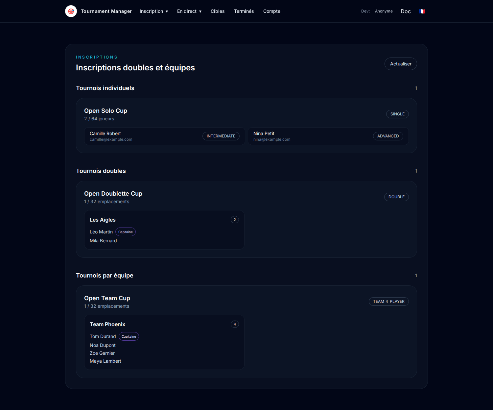
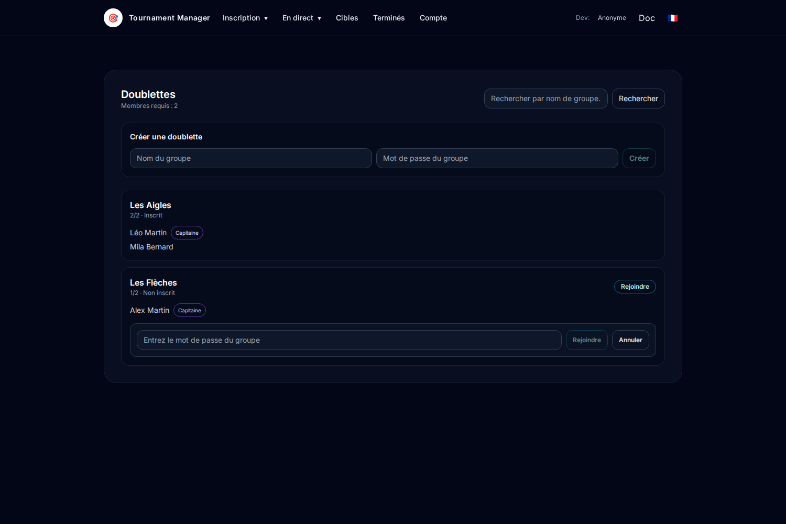
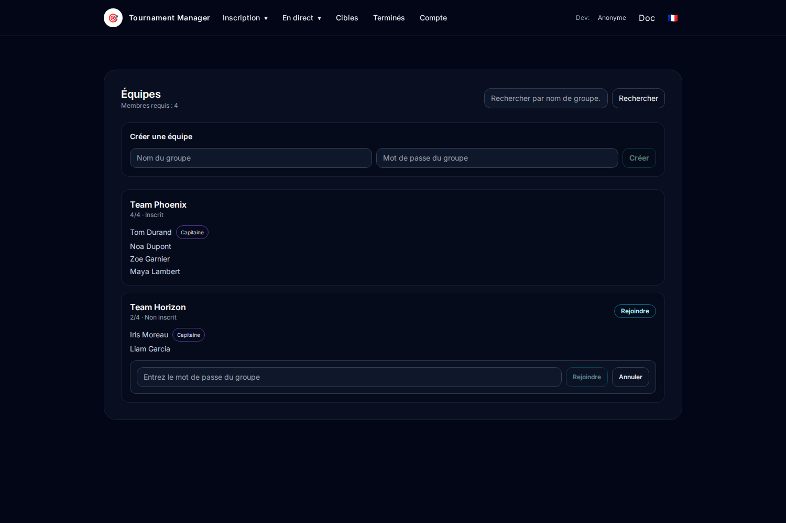
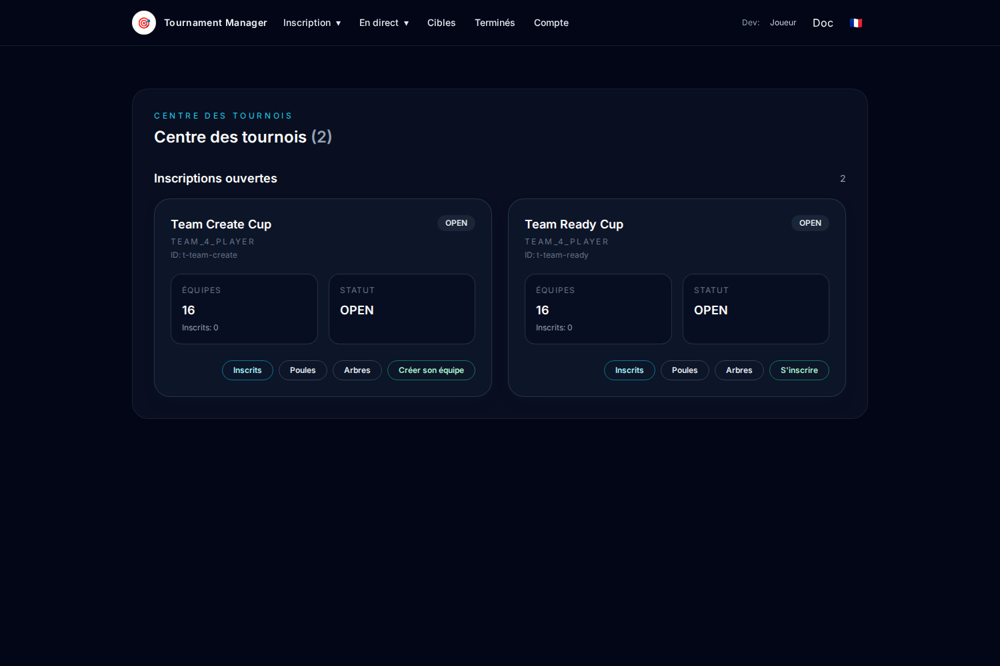
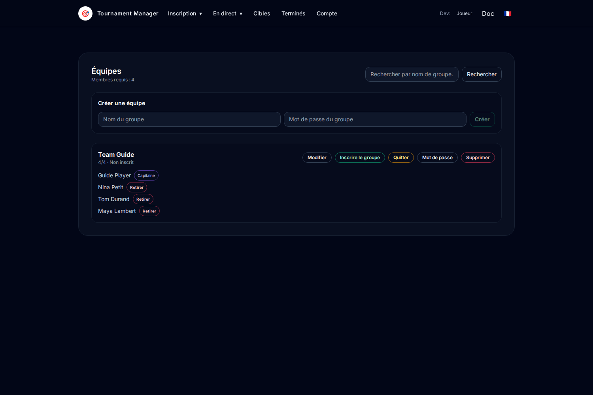

# Join a tournament (player / admin)

This guide covers registration flows for:
- single
- doublette
- team

## Access
- In app: `Doc` link in header.
- Useful views:
  - `/?view=registration-players`
  - `/?view=doublettes&tournamentId=<tournament-id>`
  - `/?view=equipes&tournamentId=<tournament-id>`

---

## 1) Single tournament

### Player
1. Open the `Registration` view.
2. Go to **Single tournaments**.
3. Confirm your registration appears in the player list.

### Admin
1. Open the `Registration` view.
2. Review entrants in **Single tournaments**.
3. Complete missing registrations before launch.

---

## 2) Doublette tournament

### Player
1. Open `Doublettes` for the selected tournament.
2. Click **Join** on an open doublette.
3. Enter the doublette password.
4. Confirm your name appears in members.

### Admin
1. Open `Doublettes` for the tournament.
2. Check composition (members, captain, registration status).
3. Validate complete and registered doublettes.

---

## 3) Team tournament

### Player
1. Open `Equipes` for the selected tournament.
2. Click **Join** on an open team.
3. Enter the team password.
4. Confirm your name appears in roster.

### Admin
1. Open `Equipes` for the tournament.
2. Check roster, captain and registration status.
3. Finalize complete teams before start.

---

## 4) Team registration from tournament card

### Player
1. Open the main tournament view (`/?status=OPEN`).
2. If you do not have a team in this tournament, click **Create my team**.
3. Once your team is complete (4 players), go back to the tournament card.
4. Click **Register** to register the team in the tournament.

### Admin
1. Verify team cards display the expected actions depending on player/group state.
2. Verify incomplete teams cannot be registered from the card.

---

## 5) Manage your team

### Player (captain)
1. Open the `Equipes` view for the tournament (`/?view=equipes&tournamentId=<tournament-id>`).
2. Manage your team with available actions: **Edit**, **Register group**, **Leave**, **Password**.
3. Verify members and group status before registration.

### Admin
1. Review each team composition and registration status.
2. Intervene if needed using administration actions.

---

## Domain reminder
- **Single**: individual entry.
- **Doublette**: 2-player group.
- **Team**: 4-player group.
- Registration is operational when player/group is complete and registered.
